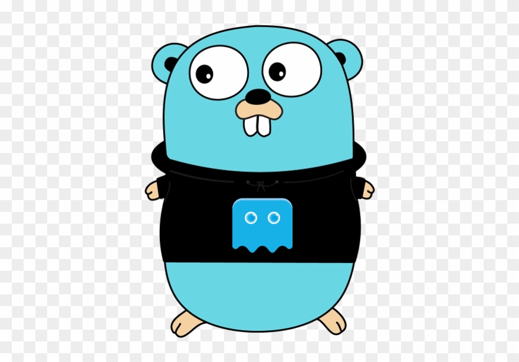

<p align="center">

</p>
<p align="center">
  <b>Go</b> SDK for the <a href="https://phantasma.io">Phantasma</a> blockchain.
</p>

<hr />


# Overview

This project aims to be an easy to use SDK for the Phantasma blockchain. It could possibly evolve to a full 
node replacement. The goal is to be fully compatible with the original [Phantasma-io](https://github.com/phantasma-io)
implementation.

- [RPC client](docs/rpc.md)
- [Script builder](docs/sriptbuilder.md)
- [Utils](docs/utils.md)

# Getting started

## Installation

PhantasmaGo is distributed as a library that includes all the functionality provided.

```
go get -u github.com/phantasma-io/phantasma-go
```

## Documentation

### Getting started
To start interacting with Phantasma blockchain you need to choose network you are planning to use (mainnet or testnet) and create corresponding RPC client.

Creation of testnet RPC client:
```
client = rpc.NewRPCTestnet()
```

Creation of mainnet RPC client:
```
client = rpc.NewRPCMainnet()
```

Code samples in the following sections of this documentation use `client` object which should be initialized in advance.

### Script Builder

Building a script is the most important part of interacting with the Phantasma blockchain. Without a propper script, the Phantasma blockchain will not know what you are trying to do.

These functions, `CallContract` and `CallInterop`, are your bread and butter for creating new scripts.

```
func (s ScriptBuilder) CallContract(contractName, method string, args ...interface{})
```

```
func (s ScriptBuilder) CallInterop(method string, args ...interface{})
```

You can find out all the diffrent `CallInterop` functions below.

For `CallContract`, you will have to look through the ABI's of all the diffrent smart contracts currently deployed on the Phantasma 'mainnet': [Link Here](https://explorer.phantasma.info/en/nexus?tab=contracts). To see all methods of a contract, for example `stake`, you can check it with explorer: [Link Here](https://explorer.phantasma.info/en/contract?id=stake&tab=methods).

#### Examples

Following code generates script to transfer `tokenAmount` amount of token `tokenSymbol` from wallet `from` to wallet `to`
```
from := "put sender address here" // Phantasma address, starting with capital 'P'
to := "put recepient address here" // Phantasma address, starting with capital 'P'
tokenAmount := big.NewInt(1000000000) // Token amount in the form of big integer
tokenSymbol := "SOUL"

sb := scriptbuilder.BeginScript()
script := sb.CallContract("gas", "AllowGas", from, cryptography.NullAddress().String(), big.NewInt(100000), big.NewInt(21000)).
    CallInterop("Runtime.TransferTokens", from, to, tokenSymbol, tokenAmount).
    CallContract("gas", "SpendGas", from).
    EndScript()
```

And here we generate script to make a call which does not require transaction, for this we use `CallContract` method:

```
address := "put caller address here" // Phantasma address, starting with capital 'P'
tokenAmount := big.NewInt(1000000000) // Token amount in the form of big integer

sb := scriptbuilder.BeginScript().
    CallContract("gas", "AllowGas", address, crypto.NullAddress().String(), big.NewInt(100000), big.NewInt(21000)).
    CallContract("stake", "Stake", address, tokenAmount).
    CallContract("gas", "SpendGas", address)
script := sb.EndScript()
```

### Script Builder Extensions

For some widely used contract calls SDK has special extension methods which make code more compact. Here's the list of available extensions:

```
func (s ScriptBuilder) AllowGas(from, to string, gasPrice, gasLimit *big.Int)
```

```
func (s ScriptBuilder) SpendGas(address string)
```

```
func (s ScriptBuilder) MintTokens(symbol, from, to string, amount *big.Int)
```

```
func (s ScriptBuilder) Stake(address string, amount *big.Int)
```

```
func (s ScriptBuilder) Unstake(address string, amount *big.Int)
```

```
func (s ScriptBuilder) TransferTokens(symbol, from, to string, amount *big.Int)
```

```
func (s ScriptBuilder) TransferBalance(symbol, from, to string)
```

#### Examples

We can rewrite examples from previous section using `AllowGas()` and `SpendGas()` extensions:

```
sb := scriptbuilder.BeginScript()
script := sb.AllowGas(from, cryptography.NullAddress().String(), big.NewInt(100000), big.NewInt(21000)).
    CallInterop("Runtime.TransferTokens", from, to, tokenSymbol, tokenAmount).
    SpendGas(from).
    EndScript()
```
```
sb := scriptbuilder.BeginScript().
    AllowGas(address, crypto.NullAddress().String(), big.NewInt(100000), big.NewInt(21000)).
    CallContract("stake", "Stake", address, tokenAmount).
    SpendGas(address)
script := sb.EndScript()
```

We can also rewrite main contract calls in these examples:

```
sb := scriptbuilder.BeginScript()
script := sb.AllowGas(from, cryptography.NullAddress().String(), big.NewInt(100000), big.NewInt(21000)).
    TransferTokens(from, to, tokenSymbol, tokenAmount).
    SpendGas(from).
    EndScript()
```
```
sb := scriptbuilder.BeginScript().
    AllowGas(address, crypto.NullAddress().String(), big.NewInt(100000), big.NewInt(21000)).
    Stake(address, tokenAmount).
    SpendGas(address)
script := sb.EndScript()
```

## Contributing

Feel free to contribute to this project after reading the
[contributing guidelines](CONTRIBUTING.md).

Before starting to work on a certain topic, create an new issue first,
describing the feature/topic you are going to implement.

# Contact

- Get in contact with us on the [Phantasma Discord](https://discord.gg/JzSnmFZCcD)

# License

- Open-source [MIT](LICENSE.md)
